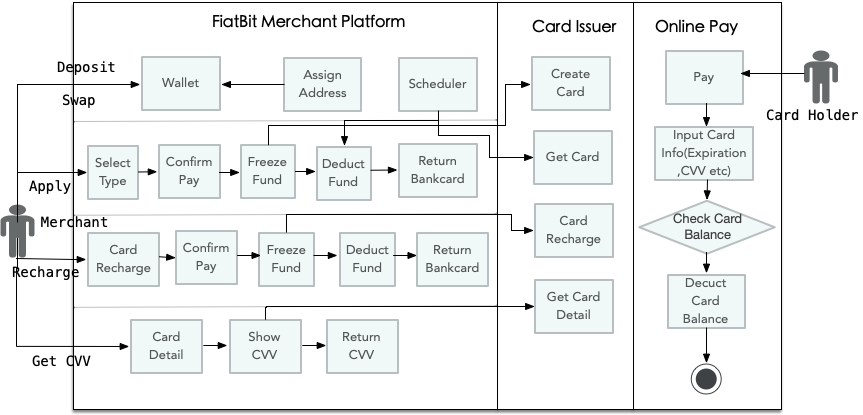
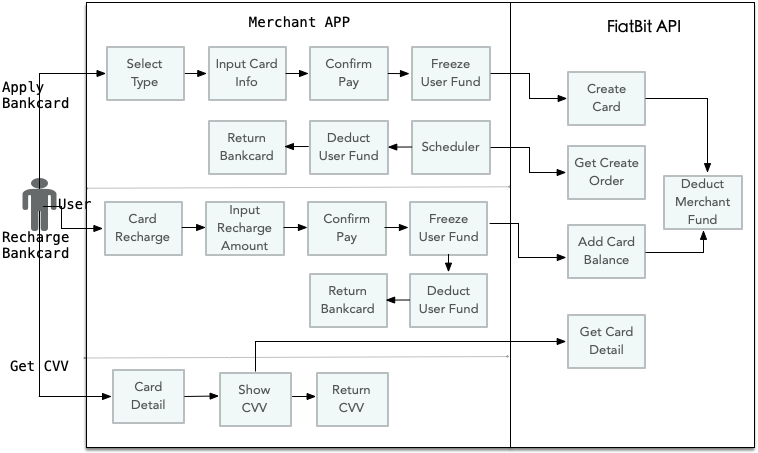
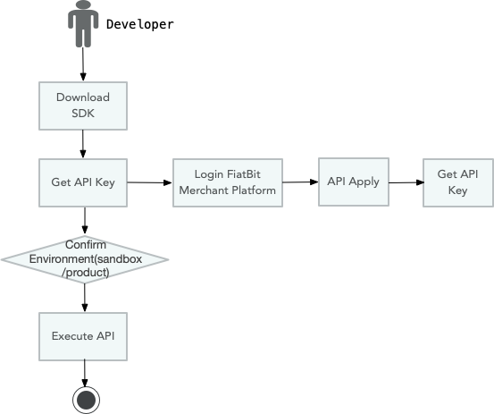

# Introduction

---

## 1. FiatBit Merchant System Business Introduction

The FiatBit merchant system helps merchants issue and manage cards.   
First, the FiatBit merchant system provides a cryptocurrency wallet function. Merchants can recharge BTC/ETH/USDT and other cryptocurrencies into their wallets, and then use the
exchange function to convert cryptocurrencies into fiat currencies. USD.  
After you have the fiat currency, you can apply for a card, and the FiatBit merchant system will automatically connect to the card issuing organization (VISA/MasterCard/AMEX).   
After the card is issued successfully, the merchant can recharge the card and check the CVV information of the card.  
After the cardholder gets the card, he can make online payment. The card needs to be recharged before payment.   
After the payment is successful, the card balance will be reduced. When the balance is insufficient, the card will not be able to pay.



---

## 2. Integrate card functionality into your own application using the FiatBit API

The FiatBit merchant system provides API functions to facilitate merchants to integrate card functions into their own applications.   
The FiatBit merchant system does not host user assets of merchants' own applications.   
When the merchant's own application applies for card activation and card recharge, the FiatBit merchant system will deduct the merchant's assets.   
After the card is successfully activated, the merchant's own application should assign the card to the corresponding user.  
Through the docking API, users can view the CVV information of the card.




---

## 3. The process for developers to use the SDK

Developers should first download the latest version of the SDK, check the sample code of the call, and need to fill in the API KEY in the code, which can be applied through the
FiatBit merchant system.   
It should be noted that developers need to confirm the environment called by the SDK, and the API keys of the test environment and the production environment are not common.



---

# API

---

## 1.1 Get account asset information

### BASIC

**Path：** /v1/openapi/account

**Method：** POST

### REQUEST

**Headers：**

| name  |  value  |  required  | desc  |
| ------------ | ------------ | ------------ | ------------ |
| Content-Type | application/json | YES |  |

### RESPONSE

**Header：**

| name  |  value  |  required  | desc  |
| ------------ | ------------ | ------------ | ------------ |
| content-type | application/json;charset=UTF-8 | NO |   |

**Body：**

| name | type | desc |
| ------------ | ------------ | ------------ |
| data | object |  | 
| &ensp;&ensp;&#124;─assetList | array |  | 
| &ensp;&ensp;&ensp;&ensp;&#124;─ | object |  | 
| &ensp;&ensp;&ensp;&ensp;&ensp;&ensp;&#124;─code | string | eg: BTC, USD, BIN1 | 
| &ensp;&ensp;&ensp;&ensp;&ensp;&ensp;&#124;─balance | string |  | 
| &ensp;&ensp;&ensp;&ensp;&ensp;&ensp;&#124;─available | string |  | 
| &ensp;&ensp;&ensp;&ensp;&ensp;&ensp;&#124;─freeze | string |  | 
| &ensp;&ensp;&#124;─currencyList | array |  | 
| &ensp;&ensp;&ensp;&ensp;&#124;─ | object |  | 
| &ensp;&ensp;&ensp;&ensp;&ensp;&ensp;&#124;─code | string | eg: BTC, USD, BIN1 | 
| &ensp;&ensp;&ensp;&ensp;&ensp;&ensp;&#124;─balance | string |  | 
| &ensp;&ensp;&ensp;&ensp;&ensp;&ensp;&#124;─available | string |  | 
| &ensp;&ensp;&ensp;&ensp;&ensp;&ensp;&#124;─freeze | string |  | 
| &ensp;&ensp;&#124;─cardNumLimitList | array |  | 
| &ensp;&ensp;&ensp;&ensp;&#124;─ | object |  | 
| &ensp;&ensp;&ensp;&ensp;&ensp;&ensp;&#124;─code | string | eg: BTC, USD, BIN1 | 
| &ensp;&ensp;&ensp;&ensp;&ensp;&ensp;&#124;─balance | string |  | 
| &ensp;&ensp;&ensp;&ensp;&ensp;&ensp;&#124;─available | string |  | 
| &ensp;&ensp;&ensp;&ensp;&ensp;&ensp;&#124;─freeze | string |  | 
| code | integer |  | 
| message | string |  | 

**Response Demo：**

```json
{
  "data": {
    "assetList": [
      {
        "code": "",
        "balance": "",
        "available": "",
        "freeze": ""
      }
    ],
    "currencyList": [
      {
        "code": "",
        "balance": "",
        "available": "",
        "freeze": ""
      }
    ],
    "cardNumLimitList": [
      {
        "code": "",
        "balance": "",
        "available": "",
        "freeze": ""
      }
    ]
  },
  "code": 0,
  "message": ""
}
```

---

## 2.1 Get the deposit address

### BASIC

**Path：** /v1/openapi/coin/getDepositAddress

**Method：** POST

### REQUEST

**Headers：**

| name  |  value  |  required  | desc  |
| ------------ | ------------ | ------------ | ------------ |
| Content-Type | application/json | YES |  |

**RequestBody**

| name | type | desc |
| ------------ | ------------ | ------------ |
| coin | string | optional value: "BTC", "ETH", "LTC", "BCH", "ETC", "XRP", "DOT", "USDT_TRC20", "USDT_ERC20", "USDT_OMNI" | 

**Request Demo：**

```json
{
  "coin": ""
}
```

### RESPONSE

**Header：**

| name  |  value  |  required  | desc  |
| ------------ | ------------ | ------------ | ------------ |
| content-type | application/json;charset=UTF-8 | NO |   |

**Body：**

| name | type | desc |
| ------------ | ------------ | ------------ |
| data | object |  | 
| &ensp;&ensp;&#124;─coin | string |  | 
| &ensp;&ensp;&#124;─depositAddress | string |  | 
| code | integer |  | 
| message | string |  | 

**Response Demo：**

```json
{
  "data": {
    "coin": "",
    "depositAddress": ""
  },
  "code": 0,
  "message": ""
}
```

---

## 2.2 Exchange

### BASIC

**Path：** /v1/openapi/coin/exchange

**Method：** POST

### REQUEST

**Headers：**

| name  |  value  |  required  | desc  |
| ------------ | ------------ | ------------ | ------------ |
| Content-Type | application/json | YES |  |

**RequestBody**

| name | type | desc |
| ------------ | ------------ | ------------ |
| asset | string | optional value: "BTC", "ETH", "LTC", "BCH", "ETC", "XRP", "DOT", "USDT" | 
| payAmount | string | eg: "0.1" | 

**Request Demo：**

```json
{
  "asset": "",
  "payAmount": ""
}
```

### RESPONSE

**Header：**

| name  |  value  |  required  | desc  |
| ------------ | ------------ | ------------ | ------------ |
| content-type | application/json;charset=UTF-8 | NO |   |

**Body：**

| name | type | desc |
| ------------ | ------------ | ------------ |
| data | object |  | 
| &ensp;&ensp;&#124;─asset | string | eg: BTC, ETH, USDT | 
| &ensp;&ensp;&#124;─quoteAsset | string | eg: USD | 
| &ensp;&ensp;&#124;─payAmount | string |  | 
| &ensp;&ensp;&#124;─receiveAmount | string |  | 
| code | integer |  | 
| message | string |  | 

**Response Demo：**

```json
{
  "data": {
    "asset": "",
    "quoteAsset": "",
    "payAmount": "",
    "receiveAmount": ""
  },
  "code": 0,
  "message": ""
}
```

---

## 3.1 Apply for a card

### BASIC

**Path：** /v1/openapi/card/{cardTypeName}/create

**Method：** POST

### REQUEST

**Path Params：**

| name         | value | desc |
| ------------ | ----- | ---- |
| cardTypeName | BIN1 |      |

**Headers：**

| name  |  value  |  required  | desc  |
| ------------ | ------------ | ------------ | ------------ |
| Content-Type | application/json | YES |  |

**RequestBody**

| name | type | desc |
| ------------ | ------------ | ------------ |
| clientOrderSn | string | client order number<br><p><br>If there is a value, an order number is processed only once; otherwise, the system automatically generates an order number;<br><p><br>required: no<br>max: 32 | 
| cardTypeName | string | optional value: "BIN1" | 
| initialAmount | string | initial amount<br><p><br>min: 10USD | 
| firstName | string |  | 
| lastName | string |  | 

**Request Demo：**

```json
{
  "clientOrderSn": "",
  "cardTypeName": "",
  "initialAmount": "",
  "firstName": "",
  "lastName": ""
}
```

### RESPONSE

**Header：**

| name  |  value  |  required  | desc  |
| ------------ | ------------ | ------------ | ------------ |
| content-type | application/json;charset=UTF-8 | NO |   |

**Body：**

| name                              | type    | desc                                                         |
| --------------------------------- | ------- | ------------------------------------------------------------ |
| data                              | object  |                                                              |
| &ensp;&ensp;&#124;─orderSn        | string  |                                                              |
| &ensp;&ensp;&#124;─clientOrderSn  | string  |                                                              |
| &ensp;&ensp;&#124;─cardTypeName   | string  | "BIN1"                                                      |
| &ensp;&ensp;&#124;─cardNumber     | string  |                                                              |
| &ensp;&ensp;&#124;─currencyCode   | string  | card currency code                                           |
| &ensp;&ensp;&#124;─initialAmount  | string  |                                                              |
| &ensp;&ensp;&#124;─fee            | string  |                                                              |
| &ensp;&ensp;&#124;─totalAmount    | string  |                                                              |
| &ensp;&ensp;&#124;─limitMonth     | integer | valid months                                                 |
| &ensp;&ensp;&#124;─firstName      | string  |                                                              |
| &ensp;&ensp;&#124;─lastName       | string  |                                                              |
| &ensp;&ensp;&#124;─billingAddress | string  | bill address                                                 |
| &ensp;&ensp;&#124;─city           | string  | bill address, city                                           |
| &ensp;&ensp;&#124;─state          | string  | bill address, state                                          |
| &ensp;&ensp;&#124;─zip            | string  | bill address, zip                                            |
| &ensp;&ensp;&#124;─status         | integer | order status<br><p><br>1 PROCESSING<br>2 SUCCESS<br>3 FAIL<br>4 CANCELED |
| &ensp;&ensp;&#124;─createTime     | string  |                                                              |
| code                              | integer |                                                              |
| message                           | string  |                                                              |

**Response Demo：**

```json
{
  "data": {
    "orderSn": "",
    "clientOrderSn": "",
    "cardTypeName": "",
    "cardNumber": "",
    "currencyCode": "",
    "initialAmount": "",
    "fee": "",
    "totalAmount": "",
    "limitMonth": 0,
    "firstName": "",
    "lastName": "",
    "billingAddress": "",
    "city": "",
    "state": "",
    "zip": "",
    "status": 0,
    "createTime": ""
  },
  "code": 0,
  "message": ""
}
```


---

## 3.2 Get the card apply order

### BASIC

**Path：** /v1/openapi/card/{cardTypeName}/getCreateOrder

**Method：** POST

### REQUEST

**Path Params：**

| name         | value | desc |
| ------------ | ----- | ---- |
| cardTypeName | BIN1 |      |

**Headers：**

| name  |  value  |  required  | desc  |
| ------------ | ------------ | ------------ | ------------ |
| Content-Type | application/json | YES |  |

**RequestBody**

| name | type | desc |
| ------------ | ------------ | ------------ |
| cardTypeName | string | optional value: "BIN1" | 
| clientOrderSn | string |  | 
| orderSn | string |  | 

**Request Demo：**

```json
{
  "cardTypeName": "",
  "clientOrderSn": "",
  "orderSn": ""
}
```

### RESPONSE

**Header：**

| name  |  value  |  required  | desc  |
| ------------ | ------------ | ------------ | ------------ |
| content-type | application/json;charset=UTF-8 | NO |   |

**Body：**

| name                              | type    | desc                                                         |
| --------------------------------- | ------- | ------------------------------------------------------------ |
| data                              | object  |                                                              |
| &ensp;&ensp;&#124;─orderSn        | string  |                                                              |
| &ensp;&ensp;&#124;─clientOrderSn  | string  |                                                              |
| &ensp;&ensp;&#124;─cardTypeName   | string  | "BIN1"                                                      |
| &ensp;&ensp;&#124;─cardNumber     | string  |                                                              |
| &ensp;&ensp;&#124;─currencyCode   | string  | card currency code                                           |
| &ensp;&ensp;&#124;─initialAmount  | string  |                                                              |
| &ensp;&ensp;&#124;─fee            | string  |                                                              |
| &ensp;&ensp;&#124;─totalAmount    | string  |                                                              |
| &ensp;&ensp;&#124;─limitMonth     | integer | valid months                                                 |
| &ensp;&ensp;&#124;─firstName      | string  |                                                              |
| &ensp;&ensp;&#124;─lastName       | string  |                                                              |
| &ensp;&ensp;&#124;─billingAddress | string  | bill address                                                 |
| &ensp;&ensp;&#124;─city           | string  | bill address, city                                           |
| &ensp;&ensp;&#124;─state          | string  | bill address, state                                          |
| &ensp;&ensp;&#124;─zip            | string  | bill address, zip                                            |
| &ensp;&ensp;&#124;─status         | integer | order status<br><p><br>1 PROCESSING<br>2 SUCCESS<br>3 FAIL<br>4 CANCELED |
| &ensp;&ensp;&#124;─createTime     | string  |                                                              |
| code                              | integer |                                                              |
| message                           | string  |                                                              |

**Response Demo：**

```json
{
  "data": {
    "orderSn": "",
    "clientOrderSn": "",
    "cardTypeName": "",
    "cardNumber": "",
    "currencyCode": "",
    "initialAmount": "",
    "fee": "",
    "totalAmount": "",
    "limitMonth": 0,
    "firstName": "",
    "lastName": "",
    "billingAddress": "",
    "city": "",
    "state": "",
    "zip": "",
    "status": 0,
    "createTime": ""
  },
  "code": 0,
  "message": ""
}
```


---

## 3.3 Get card details

### BASIC

**Path：** /v1/openapi/card/{cardTypeName}/getDetail

**Method：** POST

### REQUEST

**Path Params：**

| name         | value            | desc |
| ------------ | ---------------- | ---- |
| cardTypeName | "BIN1", "BIN2" |      |

**Headers：**

| name  |  value  |  required  | desc  |
| ------------ | ------------ | ------------ | ------------ |
| Content-Type | application/json | YES |  |

**RequestBody**

| name | type | desc |
| ------------ | ------------ | ------------ |
| cardNumber | string |  | 

**Request Demo：**

```json
{
  "cardNumber": ""
}
```

### RESPONSE

**Header：**

| name  |  value  |  required  | desc  |
| ------------ | ------------ | ------------ | ------------ |
| content-type | application/json;charset=UTF-8 | NO |   |

**Body：**

| name                              | type    | desc                                                         |
| --------------------------------- | ------- | ------------------------------------------------------------ |
| data                              | object  |                                                              |
| &ensp;&ensp;&#124;─cardTypeName   | string  | "BIN1"                                                      |
| &ensp;&ensp;&#124;─cardNumber     | string  |                                                              |
| &ensp;&ensp;&#124;─currencyCode   | string  | card currency code                                           |
| &ensp;&ensp;&#124;─balance        | string  | total balance                                                |
| &ensp;&ensp;&#124;─available      | string  | available amount                                             |
| &ensp;&ensp;&#124;─freeze         | string  | frozen amount                                                |
| &ensp;&ensp;&#124;─expiration     | string  | MMYY                                                         |
| &ensp;&ensp;&#124;─cvv            | string  |                                                              |
| &ensp;&ensp;&#124;─firstName      | string  |                                                              |
| &ensp;&ensp;&#124;─lastName       | string  |                                                              |
| &ensp;&ensp;&#124;─billingAddress | string  | billing address                                              |
| &ensp;&ensp;&#124;─city           | string  | bill address, city                                           |
| &ensp;&ensp;&#124;─state          | string  | bill address, state                                          |
| &ensp;&ensp;&#124;─zip            | string  | bill address, zip                                            |
| &ensp;&ensp;&#124;─cardStatus     | integer | 0 not enabled<br>1 normal<br>2 card printing<br>3 locked<br>4 loss<br>5 stolen<br>6 frozen<br>7 cancel |
| &ensp;&ensp;&#124;─isEnable       | boolean |                                                              |
| &ensp;&ensp;&#124;─issueTime      | string  | opening time                                                 |
| &ensp;&ensp;&#124;─ts             | integer |                                                              |
| code                              | integer |                                                              |
| message                           | string  |                                                              |

**Response Demo：**

```json
{
  "data": {
    "cardTypeName": "",
    "cardNumber": "",
    "currencyCode": "",
    "balance": "",
    "available": "",
    "freeze": "",
    "expiration": "",
    "cvv": "",
    "firstName": "",
    "lastName": "",
    "billingAddress": "",
    "city": "",
    "state": "",
    "zip": "",
    "cardStatus": 0,
    "isEnable": false,
    "issueTime": "",
    "ts": 0
  },
  "code": 0,
  "message": ""
}
```


---

## 3.4 Increase card balance

### BASIC

**Path：** /v1/openapi/card/{cardTypeName}/addBalance

**Method：** POST

### REQUEST

**Path Params：**

| name         | value            | desc |
| ------------ | ---------------- | ---- |
| cardTypeName | "BIN1", "BIN2" |      |

**Headers：**

| name  |  value  |  required  | desc  |
| ------------ | ------------ | ------------ | ------------ |
| Content-Type | application/json | YES |  |

**RequestBody**

| name | type | desc |
| ------------ | ------------ | ------------ |
| clientOrderSn | string | client order number<br><p><br>If there is a value, an order number is processed only once; otherwise, the system automatically generates an order number;<br><p><br>required: no<br>max: 32 | 
| cardNumber | string |  | 
| amount | string |  | 

**Request Demo：**

```json
{
  "clientOrderSn": "",
  "cardNumber": "",
  "amount": ""
}
```

### RESPONSE

**Header：**

| name  |  value  |  required  | desc  |
| ------------ | ------------ | ------------ | ------------ |
| content-type | application/json;charset=UTF-8 | NO |   |

**Body：**

| name                                  | type    | desc |
| ------------------------------------- | ------- | ---- |
| data                                  | object  |      |
| &ensp;&ensp;&#124;─clientOrderSn      | string  |      |
| &ensp;&ensp;&#124;─orderSn            | string  |      |
| &ensp;&ensp;&#124;─status             | integer |      |
| &ensp;&ensp;&#124;─cardNumber         | string  |      |
| &ensp;&ensp;&#124;─quoteAmount        | string  |      |
| &ensp;&ensp;&#124;─quoteCurrencyCode  | string  |      |
| &ensp;&ensp;&#124;─settleAmount       | string  |      |
| &ensp;&ensp;&#124;─settleFee          | string  |      |
| &ensp;&ensp;&#124;─settleCurrencyCode | string  |      |
| code                                  | integer |      |
| message                               | string  |      |

**Response Demo：**

```json
{
  "data": {
    "clientOrderSn": "",
    "orderSn": "",
    "status": 0,
    "cardNumber": "",
    "quoteAmount": "",
    "quoteCurrencyCode": "",
    "settleAmount": "",
    "settleFee": "",
    "settleCurrencyCode": ""
  },
  "code": 0,
  "message": ""
}
```


---

## 3.4.1 Get card recharge order

### BASIC

**Path:** /v1/openapi/card/{cardTypeName}/getRechargeOrder

**Method:** POST

REQUEST

**Path Params:**

| name | value | desc |
| ------------ | ------------ | ------------ |
| cardTypeName |  |  |

**Headers:**

| name | value | required | desc |
| ------------ | ------------ | ------------ | ------------ |
| Content-Type | application/json | YES |  |

**Request Body:**

| name | type | desc |
| ------------ | ------------ | ------------ |
| cardTypeName | string | optional value: "BIN1" |
| clientOrderSn | string |  |
| orderSn | string |  |

**Request Demo:**

```json
{
  "cardTypeName": "",
  "clientOrderSn": "",
  "orderSn": ""
}
```


RESPONSE

**Headers:**

| name | value | required | desc |
| ------------ | ------------ | ------------ | ------------ |
| content-type | application/json;charset=UTF-8 | NO |  |

**Body:**

| name | type | desc |
| ------------ | ------------ | ------------ |
| data | object |  |
| &ensp;&ensp;&#124;─orderSn | string |  |
| &ensp;&ensp;&#124;─clientOrderSn | string |  |
| &ensp;&ensp;&#124;─cardTypeName | string |  |
| &ensp;&ensp;&#124;─cardNumber | string |  |
| &ensp;&ensp;&#124;─currencyCode | string |  |
| &ensp;&ensp;&#124;─totalAmount | string |  |
| &ensp;&ensp;&#124;─fee | string |  |
| &ensp;&ensp;&#124;─actualAmount | string |  |
| &ensp;&ensp;&#124;─status | integer | order status<br><p><br>1 PROCESSING<br>2 SUCCESS<br>3 FAIL<br>4 CANCELED |
| &ensp;&ensp;&#124;─isFirst | integer | Whether to initialize the card balance when applying for a card.<br><p><br>eg: 0 false, 1 true |
| &ensp;&ensp;&#124;─settleTime | string |  |
| &ensp;&ensp;&#124;─createTime | string |  |
| code | integer |  |
| message | string |  |

**Response Demo:**

```json
{
  "data": {
    "orderSn": "",
    "clientOrderSn": "",
    "cardTypeName": "",
    "cardNumber": "",
    "currencyCode": "",
    "totalAmount": "",
    "fee": "",
    "actualAmount": "",
    "status": 0,
    "isFirst": 0,
    "settleTime": "",
    "createTime": ""
  },
  "code": 0,
  "message": ""
}
```

   

---

## 3.5 Get card transactions

### BASIC

**Path：** /v1/openapi/card/{cardTypeName}/getTransactionList

**Method：** POST

### REQUEST

**Path Params：**

| name         | value            | desc |
| ------------ | ---------------- | ---- |
| cardTypeName | "BIN1", "BIN2" |      |

**Headers：**

| name  |  value  |  required  | desc  |
| ------------ | ------------ | ------------ | ------------ |
| Content-Type | application/json | YES |  |

**RequestBody**

| name | type | desc |
| ------------ | ------------ | ------------ |
| cardNumber | string |  | 
| pageNum | integer |  | 
| pageSize | integer |  | 
| startTime | integer |  | 
| endTime | integer |  | 

**Request Demo：**

```json
{
  "cardNumber": "",
  "pageNum": 0,
  "pageSize": 0,
  "startTime": 0,
  "endTime": 0
}
```

### RESPONSE

**Header：**

| name  |  value  |  required  | desc  |
| ------------ | ------------ | ------------ | ------------ |
| content-type | application/json;charset=UTF-8 | NO |   |

**Body：**

| name                                                         | type    | desc                                                         |
| ------------------------------------------------------------ | ------- | ------------------------------------------------------------ |
| data                                                         | object  |                                                              |
| &ensp;&ensp;&#124;─page                                      | object  |                                                              |
| &ensp;&ensp;&ensp;&ensp;&#124;─pageNum                       | integer | 开始页码<br><p><br>default: 1                                |
| &ensp;&ensp;&ensp;&ensp;&#124;─pageSize                      | integer | 每页条数<br><p><br>default: 10                               |
| &ensp;&ensp;&ensp;&ensp;&#124;─total                         | integer | 总条数                                                       |
| &ensp;&ensp;&ensp;&ensp;&#124;─pages                         | integer | 总页数                                                       |
| &ensp;&ensp;&ensp;&ensp;&#124;─nextPage                      | integer | 下一页                                                       |
| &ensp;&ensp;&ensp;&ensp;&#124;─prePage                       | integer | 上一页                                                       |
| &ensp;&ensp;&#124;─list                                      | array   |                                                              |
| &ensp;&ensp;&ensp;&ensp;&#124;─                              | object  |                                                              |
| &ensp;&ensp;&ensp;&ensp;&ensp;&ensp;&#124;─intIoType         | integer | -1 out<br>1 in                                               |
| &ensp;&ensp;&ensp;&ensp;&ensp;&ensp;&#124;─cardName          | string  |                                                              |
| &ensp;&ensp;&ensp;&ensp;&ensp;&ensp;&#124;─cardNumber        | string  |                                                              |
| &ensp;&ensp;&ensp;&ensp;&ensp;&ensp;&#124;─transactionAmount | string  |                                                              |
| &ensp;&ensp;&ensp;&ensp;&ensp;&ensp;&#124;─transactionCurrencyCode | string  |                                                              |
| &ensp;&ensp;&ensp;&ensp;&ensp;&ensp;&#124;─transactionTime   | string  |                                                              |
| &ensp;&ensp;&ensp;&ensp;&ensp;&ensp;&#124;─feeAmount         | string  | transaction fee                                              |
| &ensp;&ensp;&ensp;&ensp;&ensp;&ensp;&#124;─settleAmount      | string  |                                                              |
| &ensp;&ensp;&ensp;&ensp;&ensp;&ensp;&#124;─settleCurrencyCode | string  |                                                              |
| &ensp;&ensp;&ensp;&ensp;&ensp;&ensp;&#124;─type              | string  | transaction type<br><p><br>"Credit"<br>"Debit"<br>"foreign transaction fee"<br>"authorization" |
| &ensp;&ensp;&ensp;&ensp;&ensp;&ensp;&#124;─status            | string  | transaction status<br><p><br>"Completed"<br>"Failed"<br>"PENDING"<br>"REVERSED" |
| &ensp;&ensp;&ensp;&ensp;&ensp;&ensp;&#124;─reason            | string  |                                                              |
| &ensp;&ensp;&ensp;&ensp;&ensp;&ensp;&#124;─merchantName      | string  |                                                              |
| &ensp;&ensp;&ensp;&ensp;&ensp;&ensp;&#124;─merchantAddress   | string  |                                                              |
| code                                                         | integer |                                                              |
| message                                                      | string  |                                                              |

**Response Demo：**

```json
{
  "data": {
    "page": {
      "pageNum": 0,
      "pageSize": 0,
      "total": 0,
      "pages": 0,
      "nextPage": 0,
      "prePage": 0
    },
    "list": [
      {
        "intIoType": 0,
        "cardName": "",
        "cardNumber": "",
        "transactionAmount": "",
        "transactionCurrencyCode": "",
        "transactionTime": "",
        "feeAmount": "",
        "settleAmount": "",
        "settleCurrencyCode": "",
        "type": "",
        "status": "",
        "reason": "",
        "merchantName": "",
        "merchantAddress": ""
      }
    ]
  },
  "code": 0,
  "message": ""
}
```


---

## 3.6 Add Physical Card

### BASIC

**Path：** /v1/openapi/card/{cardTypeName}/addCard

**Method：** POST

### REQUEST

**Path Params：**

| name         | value   | desc |
| ------------ | ------- | ---- |
| cardTypeName | "BIN2" |      |

**Headers：**

| name         | value            | required | desc |
| ------------ | ---------------- | -------- | ---- |
| Content-Type | application/json | YES      |      |

**RequestBody**

| name       | type   | desc |
| ---------- | ------ | ---- |
| cardNumber | string |      |
| pin        | string |      |

**Request Demo：**

```json
{
  "cardNumber": "",
  "pin": ""
}
```


### RESPONSE

**Header：**

| name         | value                          | required | desc |
| ------------ | ------------------------------ | -------- | ---- |
| content-type | application/json;charset=UTF-8 | NO       |      |

**Body：**

| name    | type    | desc |
| ------- | ------- | ---- |
| code    | integer |      |
| message | string  |      |
| data    | object  |      |

**Response Demo：**

```json
{
  "code": 0,
  "message": "",
  "data": {}
}
```


---

## 3.7 First recharge activation

### BASIC

**Path：** /v1/openapi/card/{cardTypeName}/enableCard

**Method：** POST

### REQUEST


**Path Params：**

| name         | value   | desc |
| ------------ | ------- | ---- |
| cardTypeName | "BIN2" |      |

**Headers：**

| name         | value            | required | desc |
| ------------ | ---------------- | -------- | ---- |
| Content-Type | application/json | YES      |      |

**RequestBody**

| name          | type   | desc                                                         |
| ------------- | ------ | ------------------------------------------------------------ |
| clientOrderSn | string | client order number<br><p><br>If there is a value, an order number is processed only once; otherwise, the system automatically generates an order number;<br><p><br>required: no<br>max: 32 |
| cardNumber    | string |                                                              |
| initialAmount | string |                                                              |

**Request Demo：**

```json
{
  "clientOrderSn": "",
  "cardNumber": "",
  "initialAmount": ""
}
```


### RESPONSE

**Header：**

| name         | value                          | required | desc |
| ------------ | ------------------------------ | -------- | ---- |
| content-type | application/json;charset=UTF-8 | NO       |      |

**Body：**

| name                                  | type    | desc |
| ------------------------------------- | ------- | ---- |
| data                                  | object  |      |
| &ensp;&ensp;&#124;─clientOrderSn      | string  |      |
| &ensp;&ensp;&#124;─orderSn            | string  |      |
| &ensp;&ensp;&#124;─status             | integer |      |
| &ensp;&ensp;&#124;─cardNumber         | string  |      |
| &ensp;&ensp;&#124;─quoteAmount        | string  |      |
| &ensp;&ensp;&#124;─quoteCurrencyCode  | string  |      |
| &ensp;&ensp;&#124;─settleAmount       | string  |      |
| &ensp;&ensp;&#124;─settleFee          | string  |      |
| &ensp;&ensp;&#124;─settleCurrencyCode | string  |      |
| code                                  | integer |      |
| message                               | string  |      |

**Response Demo：**

```json
{
  "data": {
    "clientOrderSn": "",
    "orderSn": "",
    "status": 0,
    "cardNumber": "",
    "quoteAmount": "",
    "quoteCurrencyCode": "",
    "settleAmount": "",
    "settleFee": "",
    "settleCurrencyCode": ""
  },
  "code": 0,
  "message": ""
}
```


---

## 4.1 Get KYC required fields

### BASIC

**Path：** /v1/openapi/card/{cardTypeName}/kyc/required

**Method：** POST

### REQUEST

**Path Params：**

| name         | value   | desc |
| ------------ | ------- | ---- |
| cardTypeName | "BIN2" |      |

**Headers：**

| name         | value            | required | desc |
| ------------ | ---------------- | -------- | ---- |
| Content-Type | application/json | YES      |      |

**RequestBody**

| name        | type   | desc                                 |
| ----------- | ------ | ------------------------------------ |
| countryCode | string | CN :CN<br>AU :AU<br>US :US<br>JP :JP |

**Request Demo：**

```json
{
  "countryCode": ""
}
```


### RESPONSE

**Header：**

| name         | value                          | required | desc |
| ------------ | ------------------------------ | -------- | ---- |
| content-type | application/json;charset=UTF-8 | NO       |      |

**Body：**

| name                            | type    | desc                                                         |
| ------------------------------- | ------- | ------------------------------------------------------------ |
| data                            | object  |                                                              |
| &ensp;&ensp;&#124;─cardTypeName | string  | "eg: BIN2"                                                  |
| &ensp;&ensp;&#124;─idType       | integer | 1 PASSPORT<br>2 ID                                           |
| &ensp;&ensp;&#124;─passportScan | boolean | Upload a scanned copy of your passport personal information page |
| &ensp;&ensp;&#124;─signature    | boolean |                                                              |
| &ensp;&ensp;&#124;─addressProof | boolean |                                                              |
| code                            | integer |                                                              |
| message                         | string  |                                                              |

**Response Demo：**

```json
{
  "data": {
    "cardTypeName": "",
    "idType": 0,
    "passportScan": false,
    "signature": false,
    "addressProof": false
  },
  "code": 0,
  "message": ""
}
```


---

## 4.2 Get KYC 

### BASIC

**Path：** /v1/openapi/card/{cardTypeName}/kyc/get

**Method：** POST

### REQUEST


**Path Params：**

| name         | value   | desc |
| ------------ | ------- | ---- |
| cardTypeName | "BIN2" |      |

**Headers：**

| name         | value            | required | desc |
| ------------ | ---------------- | -------- | ---- |
| Content-Type | application/json | YES      |      |

**RequestBody**

| name       | type   | desc |
| ---------- | ------ | ---- |
| cardNumber | string |      |

**Request Demo：**

```json
{
  "cardNumber": ""
}
```


### RESPONSE

**Header：**

| name         | value                          | required | desc |
| ------------ | ------------------------------ | -------- | ---- |
| content-type | application/json;charset=UTF-8 | NO       |      |

**Body：**

| name                                      | type    | desc                                                         |
| ----------------------------------------- | ------- | ------------------------------------------------------------ |
| data                                      | object  |                                                              |
| &ensp;&ensp;&#124;─cardNumber             | string  |                                                              |
| &ensp;&ensp;&#124;─kycStatus              | integer | kyc status<br><p><br>-1 not need<br>0 not submit<br>1 submitted<br>2 pass<br>3 reject<br>4 retry submitted<br>5 waiting audit |
| &ensp;&ensp;&#124;─passportScan           | boolean | Upload a scanned copy of your passport personal information page |
| &ensp;&ensp;&#124;─signature              | boolean |                                                              |
| &ensp;&ensp;&#124;─addressProof           | boolean |                                                              |
| &ensp;&ensp;&#124;─isPassportScanUploaded | boolean |                                                              |
| &ensp;&ensp;&#124;─isSignatureUploaded    | boolean |                                                              |
| &ensp;&ensp;&#124;─isAddressProofUploaded | boolean |                                                              |
| &ensp;&ensp;&#124;─passportScanUrl        | string  | passport scan temp url                                       |
| &ensp;&ensp;&#124;─signatureUrl           | string  | signature temp url                                           |
| &ensp;&ensp;&#124;─addressProofUrl        | string  | address proof temp url                                       |
| &ensp;&ensp;&#124;─nation                 | string  | eg: "JP"                                                     |
| &ensp;&ensp;&#124;─idType                 | integer | 1 PASSPORT<br>2 ID                                           |
| &ensp;&ensp;&#124;─idNumber               | string  | Certificate ID number                                        |
| &ensp;&ensp;&#124;─idIssueDate            | string  | Certificate issue date                                       |
| &ensp;&ensp;&#124;─idExpireDate           | string  | Certificate validity date                                    |
| &ensp;&ensp;&#124;─address                | string  |                                                              |
| &ensp;&ensp;&#124;─birthDate              | string  |                                                              |
| &ensp;&ensp;&#124;─realName               | string  |                                                              |
| &ensp;&ensp;&#124;─englishName            | string  |                                                              |
| &ensp;&ensp;&#124;─sex                    | integer |                                                              |
| &ensp;&ensp;&#124;─country                | string  | eg: "JP"                                                     |
| &ensp;&ensp;&#124;─province               | string  |                                                              |
| &ensp;&ensp;&#124;─city                   | string  |                                                              |
| &ensp;&ensp;&#124;─email                  | string  |                                                              |
| &ensp;&ensp;&#124;─occupation             | string  |                                                              |
| &ensp;&ensp;&#124;─kycTime                | string  |                                                              |
| &ensp;&ensp;&#124;─auditInfo              | string  |                                                              |
| &ensp;&ensp;&#124;─submitTime             | string  |                                                              |
| code                                      | integer |                                                              |
| message                                   | string  |                                                              |

**Response Demo：**

```json
{
  "data": {
    "cardNumber": "",
    "kycStatus": 0,
    "passportScan": false,
    "signature": false,
    "addressProof": false,
    "isPassportScanUploaded": false,
    "isSignatureUploaded": false,
    "isAddressProofUploaded": false,
    "passportScanUrl": "",
    "signatureUrl": "",
    "addressProofUrl": "",
    "nation": "",
    "idType": 0,
    "idNumber": "",
    "idIssueDate": "",
    "idExpireDate": "",
    "address": "",
    "birthDate": "",
    "realName": "",
    "englishName": "",
    "sex": 0,
    "country": "",
    "province": "",
    "city": "",
    "email": "",
    "occupation": "",
    "kycTime": "",
    "auditInfo": "",
    "submitTime": ""
  },
  "code": 0,
  "message": ""
}
```


---

## 4.3 Update KYC basic information

### BASIC

**Path：** /v1/openapi/card/{cardTypeName}/kyc/update

**Method：** POST

### REQUEST


**Path Params：**

| name         | value   | desc |
| ------------ | ------- | ---- |
| cardTypeName | "BIN2" |      |

**Headers：**

| name         | value            | required | desc |
| ------------ | ---------------- | -------- | ---- |
| Content-Type | application/json | YES      |      |

**RequestBody**

| name         | type    | desc                                 |
| ------------ | ------- | ------------------------------------ |
| cardNumber   | string  |                                      |
| countryCode  | string  | CN :CN<br>AU :AU<br>US :US<br>JP :JP |
| idType       | integer | 1: PASSPORT                          |
| idNumber     | string  | ID number                            |
| idIssueDate  | integer | Date of issue                        |
| idExpireDate | integer | Date of expiry                       |
| birthday     | integer |                                      |
| realName     | string  |                                      |
| englishName  | string  |                                      |
| gender       | string  | "M": Male<br>"F": Female             |
| province     | string  |                                      |
| city         | string  |                                      |
| address      | string  |                                      |
| email        | string  |                                      |

**Request Demo：**

```json
{
  "cardNumber": "",
  "countryCode": "",
  "idType": 0,
  "idNumber": "",
  "idIssueDate": 0,
  "idExpireDate": 0,
  "birthday": 0,
  "realName": "",
  "englishName": "",
  "gender": "",
  "province": "",
  "city": "",
  "address": "",
  "email": ""
}
```


### RESPONSE

**Header：**

| name         | value                          | required | desc |
| ------------ | ------------------------------ | -------- | ---- |
| content-type | application/json;charset=UTF-8 | NO       |      |

**Body：**

| name                                      | type    | desc                                                         |
| ----------------------------------------- | ------- | ------------------------------------------------------------ |
| data                                      | object  |                                                              |
| &ensp;&ensp;&#124;─cardNumber             | string  |                                                              |
| &ensp;&ensp;&#124;─kycStatus              | integer | kyc status<br><p><br>-1 not need<br>0 not submit<br>1 submitted<br>2 pass<br>3 reject<br>4 retry submitted<br>5 waiting audit |
| &ensp;&ensp;&#124;─passportScan           | boolean | Upload a scanned copy of your passport personal information page |
| &ensp;&ensp;&#124;─signature              | boolean |                                                              |
| &ensp;&ensp;&#124;─addressProof           | boolean |                                                              |
| &ensp;&ensp;&#124;─isPassportScanUploaded | boolean |                                                              |
| &ensp;&ensp;&#124;─isSignatureUploaded    | boolean |                                                              |
| &ensp;&ensp;&#124;─isAddressProofUploaded | boolean |                                                              |
| code                                      | integer |                                                              |
| message                                   | string  |                                                              |

**Response Demo：**

```json
{
  "data": {
    "cardNumber": "",
    "kycStatus": 0,
    "passportScan": false,
    "signature": false,
    "addressProof": false,
    "isPassportScanUploaded": false,
    "isSignatureUploaded": false,
    "isAddressProofUploaded": false
  },
  "code": 0,
  "message": ""
}
```


---

## 4.4 Upload KYC required files

### BASIC

**Path：** /v1/openapi/card/{cardTypeName}/kyc/uploadPhoto

**Method：** POST

### REQUEST

**Path Params：**

| name         | value   | desc |
| ------------ | ------- | ---- |
| cardTypeName | "BIN2" |      |

**Headers：**

| name         | value            | required | desc |
| ------------ | ---------------- | -------- | ---- |
| Content-Type | application/json | YES      |      |

**RequestBody**

| name            | type    | desc                                                 |
| --------------- | ------- | ---------------------------------------------------- |
| cardNumber      | string  |                                                      |
| uploadPhotoType | integer | PASSPORT_SCAN :1<br>SIGNATURE :2<br>ADDRESS_PROOF :3 |
| photo           | string  | upload photo<br><p><br>base64(image bytes)           |
| mimeType        | string  | eg: "image/jpeg", "image/png"                        |

**Request Demo：**

```json
{
  "cardNumber": "",
  "uploadPhotoType": 0,
  "photo": "",
  "mimeType": ""
}
```


### RESPONSE

**Header：**

| name         | value                          | required | desc |
| ------------ | ------------------------------ | -------- | ---- |
| content-type | application/json;charset=UTF-8 | NO       |      |

**Body：**

| name                                      | type    | desc                                                         |
| ----------------------------------------- | ------- | ------------------------------------------------------------ |
| data                                      | object  |                                                              |
| &ensp;&ensp;&#124;─cardNumber             | string  |                                                              |
| &ensp;&ensp;&#124;─kycStatus              | integer | kyc status<br><p><br>-1 not need<br>0 not submit<br>1 submitted<br>2 pass<br>3 reject<br>4 retry submitted<br>5 waiting audit |
| &ensp;&ensp;&#124;─passportScan           | boolean | Upload a scanned copy of your passport personal information page |
| &ensp;&ensp;&#124;─signature              | boolean |                                                              |
| &ensp;&ensp;&#124;─addressProof           | boolean |                                                              |
| &ensp;&ensp;&#124;─isPassportScanUploaded | boolean |                                                              |
| &ensp;&ensp;&#124;─isSignatureUploaded    | boolean |                                                              |
| &ensp;&ensp;&#124;─isAddressProofUploaded | boolean |                                                              |
| code                                      | integer |                                                              |
| message                                   | string  |                                                              |

**Response Demo：**

```json
{
  "data": {
    "cardNumber": "",
    "kycStatus": 0,
    "passportScan": false,
    "signature": false,
    "addressProof": false,
    "isPassportScanUploaded": false,
    "isSignatureUploaded": false,
    "isAddressProofUploaded": false
  },
  "code": 0,
  "message": ""
}
```


---

## 4.5 Submit KYC

### BASIC

**Path：** /v1/openapi/card/{cardTypeName}/kyc/submit

**Method：** POST

### REQUEST


**Path Params：**

| name         | value   | desc |
| ------------ | ------- | ---- |
| cardTypeName | "BIN2" |      |

**Headers：**

| name         | value            | required | desc |
| ------------ | ---------------- | -------- | ---- |
| Content-Type | application/json | YES      |      |

**RequestBody**

| name       | type   | desc |
| ---------- | ------ | ---- |
| cardNumber | string |      |

**Request Demo：**

```json
{
  "cardNumber": ""
}
```


### RESPONSE

**Header：**

| name         | value                          | required | desc |
| ------------ | ------------------------------ | -------- | ---- |
| content-type | application/json;charset=UTF-8 | NO       |      |

**Body：**

| name                                      | type    | desc                                                         |
| ----------------------------------------- | ------- | ------------------------------------------------------------ |
| data                                      | object  |                                                              |
| &ensp;&ensp;&#124;─cardNumber             | string  |                                                              |
| &ensp;&ensp;&#124;─kycStatus              | integer | kyc status<br><p><br>-1 not need<br>0 not submit<br>1 submitted<br>2 pass<br>3 reject<br>4 retry submitted<br>5 waiting audit |
| &ensp;&ensp;&#124;─passportScan           | boolean | Upload a scanned copy of your passport personal information page |
| &ensp;&ensp;&#124;─signature              | boolean |                                                              |
| &ensp;&ensp;&#124;─addressProof           | boolean |                                                              |
| &ensp;&ensp;&#124;─isPassportScanUploaded | boolean |                                                              |
| &ensp;&ensp;&#124;─isSignatureUploaded    | boolean |                                                              |
| &ensp;&ensp;&#124;─isAddressProofUploaded | boolean |                                                              |
| code                                      | integer |                                                              |
| message                                   | string  |                                                              |

**Response Demo：**

```json
{
  "data": {
    "cardNumber": "",
    "kycStatus": 0,
    "passportScan": false,
    "signature": false,
    "addressProof": false,
    "isPassportScanUploaded": false,
    "isSignatureUploaded": false,
    "isAddressProofUploaded": false
  },
  "code": 0,
  "message": ""
}
```

