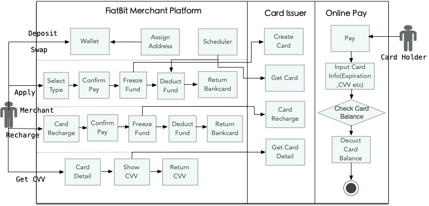
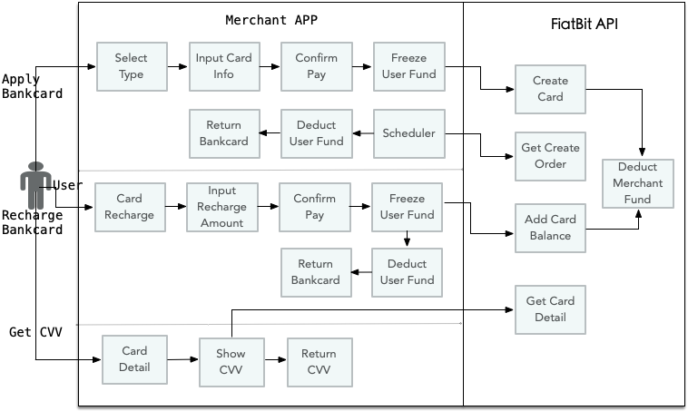
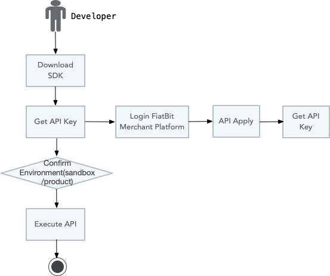

# Introduction

---

## 1. FiatBit Merchant System Business Introduction

The FiatBit merchant system helps merchants issue and manage cards.   
First, the FiatBit merchant system provides a cryptocurrency wallet function. Merchants can recharge BTC/ETH/USDT and other cryptocurrencies into their wallets, and then use the
exchange function to convert cryptocurrencies into fiat currencies. USD.  
After you have the fiat currency, you can apply for a card, and the FiatBit merchant system will automatically connect to the card issuing organization (VISA/MasterCard/AMEX).   
After the card is issued successfully, the merchant can recharge the card and check the CVV information of the card.  
After the cardholder gets the card, he can make online payment. The card needs to be recharged before payment.   
After the payment is successful, the card balance will be reduced. When the balance is insufficient, the card will not be able to pay.



---

## 2. Integrate card functionality into your own application using the FiatBit API

The FiatBit merchant system provides API functions to facilitate merchants to integrate card functions into their own applications.   
The FiatBit merchant system does not host user assets of merchants' own applications.   
When the merchant's own application applies for card activation and card recharge, the FiatBit merchant system will deduct the merchant's assets.   
After the card is successfully activated, the merchant's own application should assign the card to the corresponding user.  
Through the docking API, users can view the CVV information of the card.




---

## 3. The process for developers to use the SDK

Developers should first download the latest version of the SDK, check the sample code of the call, and need to fill in the API KEY in the code, which can be applied through the
FiatBit merchant system.   
It should be noted that developers need to confirm the environment called by the SDK, and the API keys of the test environment and the production environment are not common.



---

# API

---

## 1.1 Get account asset information

### BASIC

**Path：** /v1/openapi/account

**Method：** POST

### REQUEST

**Headers：**

| name  |  value  |  required  | desc  |
| ------------ | ------------ | ------------ | ------------ |
| Content-Type | application/json | YES |  |

### RESPONSE

**Header：**

| name  |  value  |  required  | desc  |
| ------------ | ------------ | ------------ | ------------ |
| content-type | application/json;charset=UTF-8 | NO |   |

**Body：**

| name | type | desc |
| ------------ | ------------ | ------------ |
| data | object |  | 
| &ensp;&ensp;&#124;─assetList | array |  | 
| &ensp;&ensp;&ensp;&ensp;&#124;─ | object |  | 
| &ensp;&ensp;&ensp;&ensp;&ensp;&ensp;&#124;─code | string | eg: BTC, USD, VISA1 | 
| &ensp;&ensp;&ensp;&ensp;&ensp;&ensp;&#124;─balance | string |  | 
| &ensp;&ensp;&ensp;&ensp;&ensp;&ensp;&#124;─available | string |  | 
| &ensp;&ensp;&ensp;&ensp;&ensp;&ensp;&#124;─freeze | string |  | 
| &ensp;&ensp;&#124;─currencyList | array |  | 
| &ensp;&ensp;&ensp;&ensp;&#124;─ | object |  | 
| &ensp;&ensp;&ensp;&ensp;&ensp;&ensp;&#124;─code | string | eg: BTC, USD, VISA1 | 
| &ensp;&ensp;&ensp;&ensp;&ensp;&ensp;&#124;─balance | string |  | 
| &ensp;&ensp;&ensp;&ensp;&ensp;&ensp;&#124;─available | string |  | 
| &ensp;&ensp;&ensp;&ensp;&ensp;&ensp;&#124;─freeze | string |  | 
| &ensp;&ensp;&#124;─cardNumLimitList | array |  | 
| &ensp;&ensp;&ensp;&ensp;&#124;─ | object |  | 
| &ensp;&ensp;&ensp;&ensp;&ensp;&ensp;&#124;─code | string | eg: BTC, USD, VISA1 | 
| &ensp;&ensp;&ensp;&ensp;&ensp;&ensp;&#124;─balance | string |  | 
| &ensp;&ensp;&ensp;&ensp;&ensp;&ensp;&#124;─available | string |  | 
| &ensp;&ensp;&ensp;&ensp;&ensp;&ensp;&#124;─freeze | string |  | 
| code | integer |  | 
| message | string |  | 

**Response Demo：**

```json
{
  "data": {
    "assetList": [
      {
        "code": "",
        "balance": "",
        "available": "",
        "freeze": ""
      }
    ],
    "currencyList": [
      {
        "code": "",
        "balance": "",
        "available": "",
        "freeze": ""
      }
    ],
    "cardNumLimitList": [
      {
        "code": "",
        "balance": "",
        "available": "",
        "freeze": ""
      }
    ]
  },
  "code": 0,
  "message": ""
}
```

---

## 2.1 Get the deposit address

### BASIC

**Path：** /v1/openapi/coin/getDepositAddress

**Method：** POST

### REQUEST

**Headers：**

| name  |  value  |  required  | desc  |
| ------------ | ------------ | ------------ | ------------ |
| Content-Type | application/json | YES |  |

**RequestBody**

| name | type | desc |
| ------------ | ------------ | ------------ |
| coin | string | optional value: "BTC", "ETH", "LTC", "BCH", "ETC", "XRP", "DOT", "USDT_TRC20", "USDT_ERC20", "USDT_OMNI" | 

**Request Demo：**

```json
{
  "coin": ""
}
```

### RESPONSE

**Header：**

| name  |  value  |  required  | desc  |
| ------------ | ------------ | ------------ | ------------ |
| content-type | application/json;charset=UTF-8 | NO |   |

**Body：**

| name | type | desc |
| ------------ | ------------ | ------------ |
| data | object |  | 
| &ensp;&ensp;&#124;─coin | string |  | 
| &ensp;&ensp;&#124;─depositAddress | string |  | 
| code | integer |  | 
| message | string |  | 

**Response Demo：**

```json
{
  "data": {
    "coin": "",
    "depositAddress": ""
  },
  "code": 0,
  "message": ""
}
```

---

## 2.2 Exchange

### BASIC

**Path：** /v1/openapi/coin/exchange

**Method：** POST

### REQUEST

**Headers：**

| name  |  value  |  required  | desc  |
| ------------ | ------------ | ------------ | ------------ |
| Content-Type | application/json | YES |  |

**RequestBody**

| name | type | desc |
| ------------ | ------------ | ------------ |
| asset | string | optional value: "BTC", "ETH", "LTC", "BCH", "ETC", "XRP", "DOT", "USDT" | 
| payAmount | string | eg: "0.1" | 

**Request Demo：**

```json
{
  "asset": "",
  "payAmount": ""
}
```

### RESPONSE

**Header：**

| name  |  value  |  required  | desc  |
| ------------ | ------------ | ------------ | ------------ |
| content-type | application/json;charset=UTF-8 | NO |   |

**Body：**

| name | type | desc |
| ------------ | ------------ | ------------ |
| data | object |  | 
| &ensp;&ensp;&#124;─asset | string | eg: BTC, ETH, USDT | 
| &ensp;&ensp;&#124;─quoteAsset | string | eg: USD | 
| &ensp;&ensp;&#124;─payAmount | string |  | 
| &ensp;&ensp;&#124;─receiveAmount | string |  | 
| code | integer |  | 
| message | string |  | 

**Response Demo：**

```json
{
  "data": {
    "asset": "",
    "quoteAsset": "",
    "payAmount": "",
    "receiveAmount": ""
  },
  "code": 0,
  "message": ""
}
```

---

## 3.1 Apply for a card

### BASIC

**Path：** /v1/openapi/card/{cardTypeName}/create

**Method：** POST

### REQUEST

**Headers：**

| name  |  value  |  required  | desc  |
| ------------ | ------------ | ------------ | ------------ |
| Content-Type | application/json | YES |  |

**RequestBody**

| name | type | desc |
| ------------ | ------------ | ------------ |
| clientOrderSn | string | client order number<br><p><br>If there is a value, an order number is processed only once; otherwise, the system automatically generates an order number;<br><p><br>required: no<br>max: 32 | 
| cardTypeName | string | optional value: "VISA1" | 
| initialAmount | string | initial amount<br><p><br>min: 10USD | 
| firstName | string |  | 
| lastName | string |  | 

**Request Demo：**

```json
{
  "clientOrderSn": "",
  "cardTypeName": "",
  "initialAmount": "",
  "firstName": "",
  "lastName": ""
}
```

### RESPONSE

**Header：**

| name  |  value  |  required  | desc  |
| ------------ | ------------ | ------------ | ------------ |
| content-type | application/json;charset=UTF-8 | NO |   |

**Body：**

| name | type | desc |
| ------------ | ------------ | ------------ |
| data | object |  | 
| &ensp;&ensp;&#124;─clientOrderSn | string | client order number | 
| &ensp;&ensp;&#124;─orderSn | string | system order number | 
| code | integer |  | 
| message | string |  | 

**Response Demo：**

```json
{
  "data": {
    "clientOrderSn": "",
    "orderSn": ""
  },
  "code": 0,
  "message": ""
}
```

---

## 3.2 Get the card apply order

### BASIC

**Path：** /v1/openapi/card/{cardTypeName}/getCreateOrder

**Method：** POST

### REQUEST

**Headers：**

| name  |  value  |  required  | desc  |
| ------------ | ------------ | ------------ | ------------ |
| Content-Type | application/json | YES |  |

**RequestBody**

| name | type | desc |
| ------------ | ------------ | ------------ |
| cardTypeName | string | optional value: "VISA1" | 
| clientOrderSn | string |  | 
| orderSn | string |  | 

**Request Demo：**

```json
{
  "cardTypeName": "",
  "clientOrderSn": "",
  "orderSn": ""
}
```

### RESPONSE

**Header：**

| name  |  value  |  required  | desc  |
| ------------ | ------------ | ------------ | ------------ |
| content-type | application/json;charset=UTF-8 | NO |   |

**Body：**

| name | type | desc |
| ------------ | ------------ | ------------ |
| data | object |  | 
| &ensp;&ensp;&#124;─orderSn | string |  | 
| &ensp;&ensp;&#124;─clientOrderSn | string |  | 
| &ensp;&ensp;&#124;─cardTypeName | string | "VISA1" | 
| &ensp;&ensp;&#124;─cardNumber | string |  | 
| &ensp;&ensp;&#124;─currencyCode | string | card currency code | 
| &ensp;&ensp;&#124;─initialAmount | string |  | 
| &ensp;&ensp;&#124;─fee | string |  | 
| &ensp;&ensp;&#124;─totalAmount | string |  | 
| &ensp;&ensp;&#124;─limitMonth | integer | valid months | 
| &ensp;&ensp;&#124;─firstName | string |  | 
| &ensp;&ensp;&#124;─lastName | string |  | 
| &ensp;&ensp;&#124;─billingAddress | string | bill address | 
| &ensp;&ensp;&#124;─city | string | bill address, city | 
| &ensp;&ensp;&#124;─state | string | bill address, state | 
| &ensp;&ensp;&#124;─zip | string | bill address, zip | 
| &ensp;&ensp;&#124;─status | integer | 1 PROCESSING<br>2 SUCCESS<br>3 FAIL<br>4 CANCELED | 
| &ensp;&ensp;&#124;─createTime | string |  | 
| code | integer |  | 
| message | string |  | 

**Response Demo：**

```json
{
  "data": {
    "orderSn": "",
    "clientOrderSn": "",
    "cardTypeName": "",
    "cardNumber": "",
    "currencyCode": "",
    "initialAmount": "",
    "fee": "",
    "totalAmount": "",
    "limitMonth": 0,
    "firstName": "",
    "lastName": "",
    "billingAddress": "",
    "city": "",
    "state": "",
    "zip": "",
    "status": 0,
    "createTime": ""
  },
  "code": 0,
  "message": ""
}
```

---

## 3.3 Get card details

### BASIC

**Path：** /v1/openapi/card/{cardTypeName}/getDetail

**Method：** POST

### REQUEST

**Headers：**

| name  |  value  |  required  | desc  |
| ------------ | ------------ | ------------ | ------------ |
| Content-Type | application/json | YES |  |

**RequestBody**

| name | type | desc |
| ------------ | ------------ | ------------ |
| cardNumber | string |  | 

**Request Demo：**

```json
{
  "cardNumber": ""
}
```

### RESPONSE

**Header：**

| name  |  value  |  required  | desc  |
| ------------ | ------------ | ------------ | ------------ |
| content-type | application/json;charset=UTF-8 | NO |   |

**Body：**

| name | type | desc |
| ------------ | ------------ | ------------ |
| data | object |  | 
| &ensp;&ensp;&#124;─cardTypeName | string | "VISA1" | 
| &ensp;&ensp;&#124;─cardNumber | string |  | 
| &ensp;&ensp;&#124;─currencyCode | string | card currency code | 
| &ensp;&ensp;&#124;─balance | string | total balance | 
| &ensp;&ensp;&#124;─available | string | available amount | 
| &ensp;&ensp;&#124;─freeze | string | frozen amount | 
| &ensp;&ensp;&#124;─expiration | string | Validity period | 
| &ensp;&ensp;&#124;─cvv | string | sensitive field, refer to sdk for handling | 
| &ensp;&ensp;&#124;─firstName | string |  | 
| &ensp;&ensp;&#124;─lastName | string |  | 
| &ensp;&ensp;&#124;─billingAddress | string | billing address | 
| &ensp;&ensp;&#124;─city | string | bill address, city | 
| &ensp;&ensp;&#124;─state | string | bill address, state | 
| &ensp;&ensp;&#124;─zip | string | bill address, zip | 
| &ensp;&ensp;&#124;─cardStatus | integer | 0 not enabled<br>1 normal<br>2 card printing<br>3 locked<br>4 loss<br>5 stolen<br>6 frozen<br>7 cancel | 
| &ensp;&ensp;&#124;─isEnable | boolean |  | 
| &ensp;&ensp;&#124;─issueTime | integer | opening time | 
| &ensp;&ensp;&#124;─ts | integer |  | 
| code | integer |  | 
| message | string |  | 

**Response Demo：**

```json
{
  "data": {
    "cardTypeName": "",
    "cardNumber": "",
    "currencyCode": "",
    "balance": "",
    "available": "",
    "freeze": "",
    "expiration": "",
    "cvv": "",
    "firstName": "",
    "lastName": "",
    "billingAddress": "",
    "city": "",
    "state": "",
    "zip": "",
    "cardStatus": 0,
    "isEnable": false,
    "issueTime": 0,
    "ts": 0
  },
  "code": 0,
  "message": ""
}
```

---

## 3.4 Increase card balance

### BASIC

**Path：** /v1/openapi/card/{cardTypeName}/addBalance

**Method：** POST

### REQUEST

**Headers：**

| name  |  value  |  required  | desc  |
| ------------ | ------------ | ------------ | ------------ |
| Content-Type | application/json | YES |  |

**RequestBody**

| name | type | desc |
| ------------ | ------------ | ------------ |
| clientOrderSn | string | client order number<br><p><br>If there is a value, an order number is processed only once; otherwise, the system automatically generates an order number;<br><p><br>required: no<br>max: 32 | 
| cardNumber | string |  | 
| amount | string |  | 

**Request Demo：**

```json
{
  "clientOrderSn": "",
  "cardNumber": "",
  "amount": ""
}
```

### RESPONSE

**Header：**

| name  |  value  |  required  | desc  |
| ------------ | ------------ | ------------ | ------------ |
| content-type | application/json;charset=UTF-8 | NO |   |

**Body：**

| name | type | desc |
| ------------ | ------------ | ------------ |
| data | object |  | 
| &ensp;&ensp;&#124;─clientOrderSn | string |  | 
| &ensp;&ensp;&#124;─orderSn | string |  | 
| &ensp;&ensp;&#124;─cardNumber | string |  | 
| &ensp;&ensp;&#124;─amount | string |  | 
| code | integer |  | 
| message | string |  | 

**Response Demo：**

```json
{
  "data": {
    "clientOrderSn": "",
    "orderSn": "",
    "cardNumber": "",
    "amount": ""
  },
  "code": 0,
  "message": ""
}
```

---

## 3.5 Get card transactions

### BASIC

**Path：** /v1/openapi/card/{cardTypeName}/getTransactionList

**Method：** POST

### REQUEST

**Headers：**

| name  |  value  |  required  | desc  |
| ------------ | ------------ | ------------ | ------------ |
| Content-Type | application/json | YES |  |

**RequestBody**

| name | type | desc |
| ------------ | ------------ | ------------ |
| cardNumber | string |  | 
| pageNum | integer |  | 
| pageSize | integer |  | 
| startTime | integer |  | 
| endTime | integer |  | 

**Request Demo：**

```json
{
  "cardNumber": "",
  "pageNum": 0,
  "pageSize": 0,
  "startTime": 0,
  "endTime": 0
}
```

### RESPONSE

**Header：**

| name  |  value  |  required  | desc  |
| ------------ | ------------ | ------------ | ------------ |
| content-type | application/json;charset=UTF-8 | NO |   |

**Body：**

| name | type | desc |
| ------------ | ------------ | ------------ |
| data | object |  | 
| &ensp;&ensp;&#124;─page | object |  | 
| &ensp;&ensp;&ensp;&ensp;&#124;─pageNum | integer | default: 1 | 
| &ensp;&ensp;&ensp;&ensp;&#124;─pageSize | integer | default: 10 | 
| &ensp;&ensp;&ensp;&ensp;&#124;─total | integer |  | 
| &ensp;&ensp;&ensp;&ensp;&#124;─pages | integer |  | 
| &ensp;&ensp;&ensp;&ensp;&#124;─nextPage | integer |  | 
| &ensp;&ensp;&ensp;&ensp;&#124;─prePage | integer |  | 
| &ensp;&ensp;&#124;─list | array |  | 
| &ensp;&ensp;&ensp;&ensp;&#124;─ | object |  | 
| &ensp;&ensp;&ensp;&ensp;&ensp;&ensp;&#124;─intIoType | integer | -1 out<br>1 in | 
| &ensp;&ensp;&ensp;&ensp;&ensp;&ensp;&#124;─cardName | string |  | 
| &ensp;&ensp;&ensp;&ensp;&ensp;&ensp;&#124;─cardNumber | string |  | 
| &ensp;&ensp;&ensp;&ensp;&ensp;&ensp;&#124;─transactionAmount | string |  | 
| &ensp;&ensp;&ensp;&ensp;&ensp;&ensp;&#124;─transactionTime | integer |  | 
| &ensp;&ensp;&ensp;&ensp;&ensp;&ensp;&#124;─type | string | transaction type<br><p><br>"Credit"<br>"Debit"<br>"foreign transaction fee"<br>"authorization" | 
| &ensp;&ensp;&ensp;&ensp;&ensp;&ensp;&#124;─status | string | transaction status<br><br>"Completed"<br>"Failed"<br>"PENDING"<br>"REVERSED" | 
| &ensp;&ensp;&ensp;&ensp;&ensp;&ensp;&#124;─reason | string |  | 
| &ensp;&ensp;&ensp;&ensp;&ensp;&ensp;&#124;─merchantName | string |  | 
| &ensp;&ensp;&ensp;&ensp;&ensp;&ensp;&#124;─merchantAddress | string |  | 
| code | integer |  | 
| message | string |  | 

**Response Demo：**

```json
{
  "data": {
    "page": {
      "pageNum": 0,
      "pageSize": 0,
      "total": 0,
      "pages": 0,
      "nextPage": 0,
      "prePage": 0
    },
    "list": [
      {
        "intIoType": 0,
        "cardName": "",
        "cardNumber": "",
        "transactionAmount": "",
        "transactionTime": 0,
        "type": "",
        "status": "",
        "reason": "",
        "merchantName": "",
        "merchantAddress": ""
      }
    ]
  },
  "code": 0,
  "message": ""
}
```


